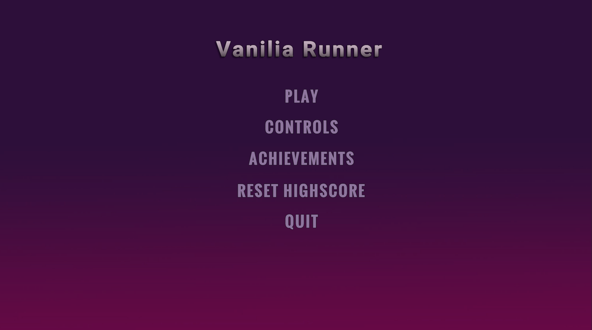
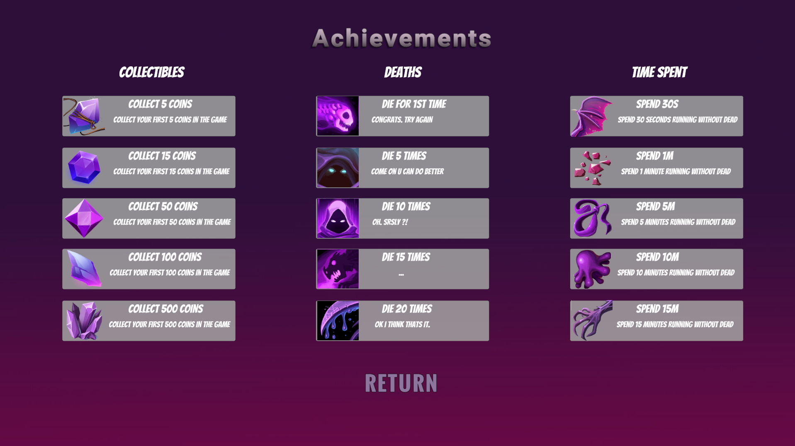
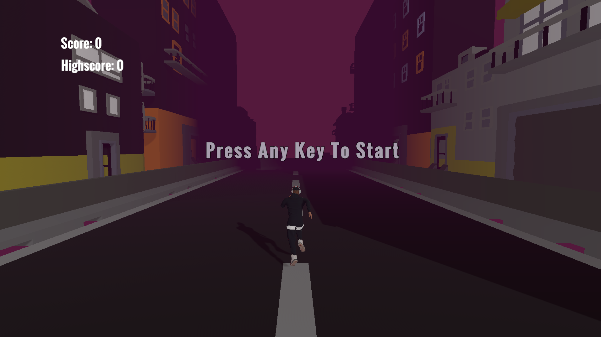

# Vanillia Runner
Projekt gry gatunku Endless Runner realizowany na studiach.

## Mechaniki 
- Automatyczny bieg postaci. Gracz steruje ruchami na lewo i prawo.
- System punktów oparty na zbieraniu krszytałow znajdujacych sie na mapie.
- System osiągnięć podzielony na 3 kategorię: Ilość zebranych krzsytałow, czas spędzony w grze i ilość poniesionych śmierci.
- Losowe generowanie kafelek mapy przed graczem.
- Zwiekszająca sie predkość biegu wraz z czasem gry.
- Mgła wojny ograniczająca widoczność gracza do 2 kafelek.  
### Gra stworzona przy użyciu.
- C# 
- Unity Engine
- Asset Forge
### Link do buildu.
https://vaniliatime.itch.io/vanilliarunner
### Prezentacja zrzutów ekranu z gry.

### <b>Menu</b> 

### <b>Controls </b> 

### <b>Achievements</b> 

### <b>Game </b> 

### <b>GameOver</b> 

